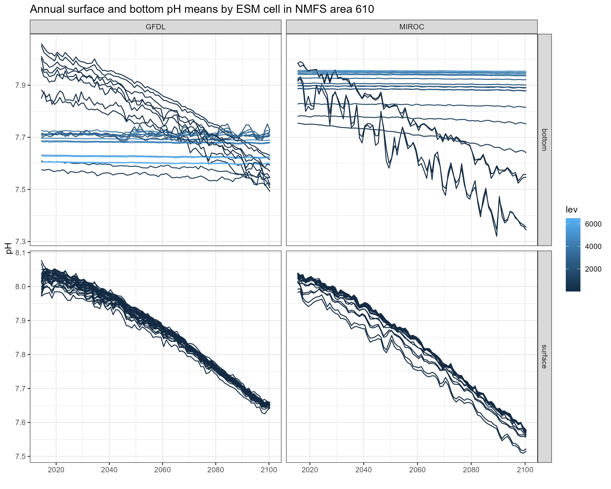
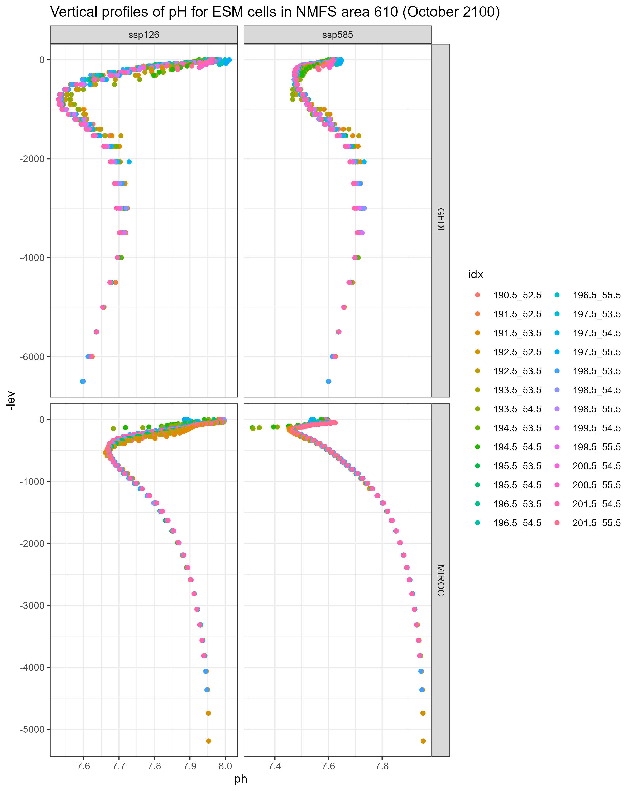

# Mapping ESM outputs to GOA NMFS areas

This code maps output from Earth System Models to the NMFS areas in the Gulf of Alaska. ESMs currently processed are:

- GFDL
- MIROC

The scenarios currently examined are:

- historical
- SSP-126
- SSP-585

Variables currently extracted are:

- pH

We extract variables from the deepest and shallowest slice for each ESM cell (1 degree x 1 degree), assuming them to be representative of bottom and surface conditions, respectively. Output are on a monthly time step. 

We are not performing any spatial statistical downscaling at present. We intersect ESM cells with the NMFS management areas (shallower than 1000 m) and average the variables per time step weighting values by the area of the intersection.

# Data extraction

Data were pulled from [here](https://esgf-node.llnl.gov/search/cmip6/). Search tips from Kelly Kearney were used: "When searching for individual datasets, I'll usually select the Source ID and Variant Label from the left-hand filters, then press the "Search" button; that will eliminate a lot of the options and minimize scrolling.  Then select "ocnBgchem" from the Realm options, and press "Search" again.  Finally, select the specific variable or variables that you want.  For ph, most models will probably have the data at monthly resolution (Table ID "Omon").  A few models offer data on either the native grid ("gn") or regridded to a more standard lat/lon/depth grid ("gr"); the latter is almost always what you'll want."

The spatial resolution for all these data sets was 1x1 degree.

# Caveat

 - If the interest is on cod nursery grounds only, we may skew the averages by including cells that are really deep / in the wrong general area. 
 - MIROC cells seems sparser than GFDL - i.e. there are fewer overlapping with the GOA
 - Vertical structure (lev) seem to differ between ESMs - so taking the top and bottom slice from each model may mean that we are pulling output from slightly different depths.
 - I cannot find CESM2 pH projection experiments.
 

# MIROC vs GFDL bottom pH

Values of bottom pH differ greatly between GFDL and MIROC, even within the same NMFS area (see figures below). One possible explanation is that the vertical layers differ between the two models, so values of pH pulled from the deepest slice may be different because the depths of the deepest slices themselves are different. Average depth of ESM cells per NMFS area is not that different between the two models though. 

It does not seem to be an issue with the code - the MIROC projections I pulled simply have much higher values of pH at depth.

