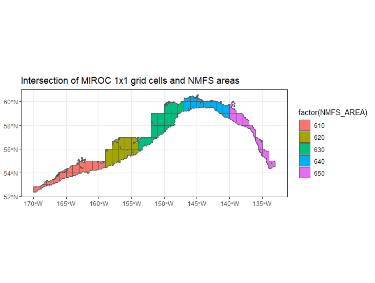

# Mapping ESM outputs to GOA NMFS areas

This code maps output from Earth System Models to the NMFS areas in the Gulf of Alaska. ESMs currently processed are:

- GFDL
- MIROC

The scenarios currently examined are:

- historical
- SSP-126
- SSP-585

Variables currently extracted are:

- pH

We extract variables from the deepest and shallowest slice for each ESM cell (1 degree x 1 degree), assuming them to be representative of bottom and surface conditions, respectively. Output are on a monthly time step. 

We are not performing any spatial statistical downscaling at present. We intersect ESM cells with the NMFS management areas (shallower than 1000 m) and average the variables per time step weighting values by the area of the intersection.

Caveats:

 - If the interest is on cod nursery grounds only, we may skew the averages by including cells that are really deep / in the wrong general area. 
 - MIROC cells seems sparser than GFDL - i.e. there are fewer overlapping with the GOA
 - Vertical structure (lev) seem to differ between ESMs - so taking the top and bottom slice from each model may mean that we are pulling output from slightly different depths.
 - I cannot find CESM2 pH projection experiments.
